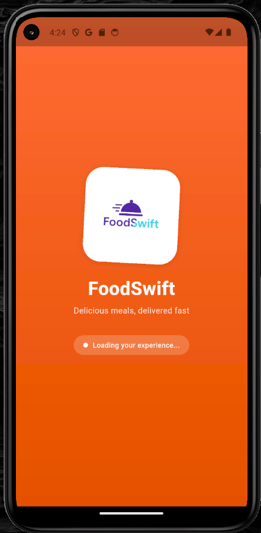
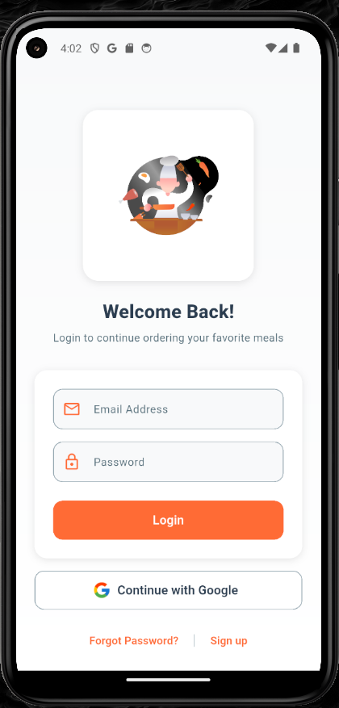
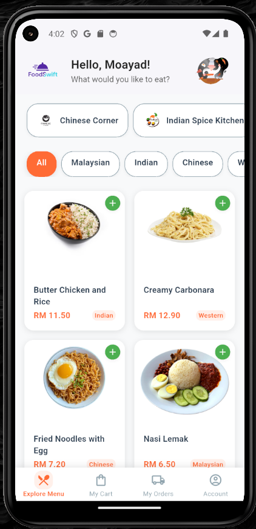
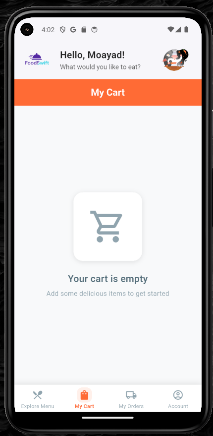
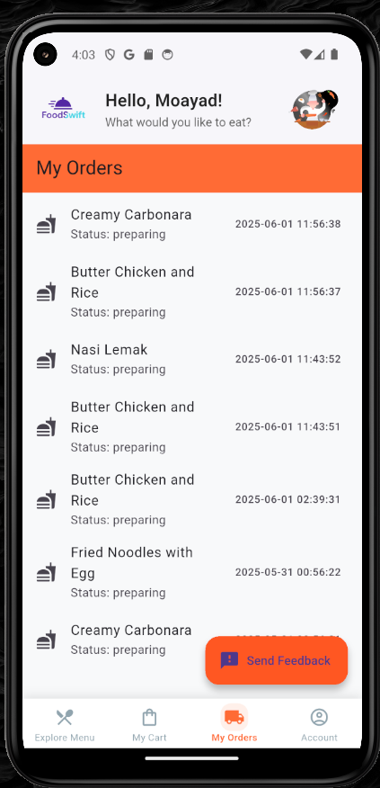
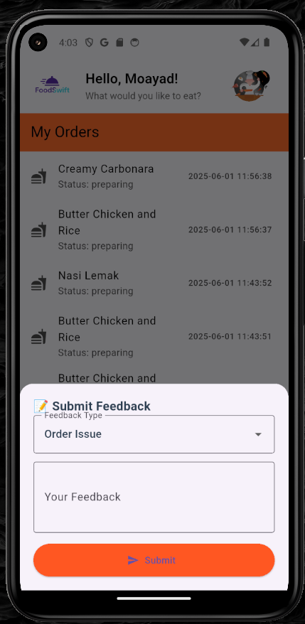

# �️ FoodSwift - Smart University Campus Canteen Ordering

FoodSwift is a smart university campus canteen ordering application designed to improve the food ordering experience inside university campuses. The app helps students browse available meals, customize their orders, pre-order food, track order status in real time, and pick up their meals from the canteen without waiting in long queues during peak hours.

FoodSwift includes different user roles, such as students, canteen staff, and admin managers. Students can place and track orders, canteen staff can manage incoming orders and update food availability, while admins can monitor operations, review reports, manage system data, and improve service efficiency.

The project focuses on solving common university canteen problems such as long queues, manual order handling, unclear food availability, order mistakes, and lack of real-time tracking. By digitalizing the ordering process, FoodSwift provides a faster, more organized, and user-friendly experience for both students and canteen operators.

## 📱 Screenshots

<div align="center">

### 🚀 **Splash Screen**


### Login Screen


### Registration Screen


### Canteen Menu Browse


### Shopping Cart


### Order Tracking


</div>

## Features

### 🎨 **Modern UI/UX Design**
- **Contemporary Design System**: Modern color palette with orange/red gradient theme
- **Consistent Typography**: Well-defined text styles for better readability
- **Smooth Animations**: Elastic animations and transitions for enhanced user experience
- **Responsive Layout**: Optimized for various screen sizes and orientations

### 🔐 **Authentication System**
- **Email/Password Login**: Secure user authentication with Firebase
- **Google Sign-In**: Quick social login integration
- **User Registration**: Streamlined sign-up process
- **Password Recovery**: Forgot password functionality

### 🍽️ **Menu & Ordering**
- **Canteen Menu Browse**: Browse available meals from campus canteens
- **Food Type Filtering**: Filter by cuisine types (Malaysian, Indian, Chinese, Western)
- **Detailed Menu Items**: Rich product cards with images, prices, and descriptions
- **Pre-order Options**: Schedule meals in advance to avoid peak hour queues
- **Customization Options**: Spice level, portion size, and special notes

### 🛒 **Shopping Cart**
- **Cart Management**: Add, edit, and remove items from cart
- **Real-time Updates**: Live price calculations and availability checks
- **Order Summary**: Clear breakdown of items and totals
- **Pre-order Checkout**: Schedule pickup time to avoid waiting

### 📦 **Order Tracking**
- **Real-time Status**: Live order updates (Preparing, Ready for Pickup, Completed)
- **Order History**: View past orders and details
- **Pickup Notifications**: Get alerts when your order is ready
- **Canteen Information**: Complete canteen details and operating hours

### 👤 **User Profile**
- **Account Management**: Update personal information and student details
- **Order Preferences**: Manage pickup preferences and dietary requirements
- **Settings**: App customization options and notification preferences

### 🛠️ **Admin Dashboard**
- **Analytics Overview**: Track orders, peak hours, and student preferences
- **Menu Management**: Add, edit, and remove menu items and availability
- **Staff Management**: Manage canteen staff roles and permissions
- **Operations Monitoring**: Real-time order tracking and queue management
- **Feedback System**: Monitor student feedback and improve service

## 🚀 Technology Stack

### Frontend
- **Flutter 3.x**: Cross-platform mobile app development
- **Dart**: Programming language for Flutter apps

### State Management
- **Riverpod**: Modern state management solution
- **Firebase Auth**: Authentication and user management

### Backend & Database
- **Firebase Firestore**: NoSQL cloud database
- **Firebase Storage**: Cloud storage for images and media
- **Firebase Cloud Messaging**: Push notifications

### UI/UX
- **Material Design 3**: Modern design principles
- **Lottie Animations**: Smooth, engaging animations
- **Custom Design System**: Consistent theming and styling

## 📋 Requirements

- **Flutter SDK**: 3.0.0 or higher
- **Dart SDK**: 2.17.0 or higher
- **Android SDK**: API level 21 (Android 5.0) or higher
- **iOS**: iOS 11.0 or higher (for iOS development)

## 🛠️ Installation

### Prerequisites
1. Install [Flutter SDK](https://flutter.dev/docs/get-started/install)
2. Set up your preferred development environment (Android Studio / VS Code)
3. Configure Android/iOS emulators or physical devices

### Setup Instructions

1. **Clone the repository**
   ```bash
   git clone https://github.com/your-username/foodswift.git
   cd foodswift
   ```

2. **Install dependencies**
   ```bash
   flutter pub get
   ```

3. **Firebase Configuration**
   - Create a new Firebase project at [Firebase Console](https://console.firebase.google.com/)
   - Enable Authentication (Email/Password and Google Sign-In)
   - Set up Firestore Database
   - Configure Firebase Storage
   - Download `google-services.json` (Android) and place it in `android/app/`
   - Download `GoogleService-Info.plist` (iOS) and place it in `ios/Runner/`
   - Update `lib/firebase_options.dart` with your Firebase configuration

4. **Run the application**
   ```bash
   flutter run
   ```

## 📱 Development

### Running on Different Platforms

```bash
# Run on Android
flutter run -d android

# Run on iOS
flutter run -d ios

# Run on Web
flutter run -d chrome

# Run on Windows
flutter run -d windows

# Run on macOS
flutter run -d macos

# Run on Linux
flutter run -d linux
```

### Development Commands

```bash
# Install dependencies
flutter pub get

# Update dependencies
flutter pub upgrade

# Clean build cache
flutter clean

# Analyze code
flutter analyze

# Run tests
flutter test

# Build APK
flutter build apk

# Build iOS
flutter build ios
```

## 🎨 Design System

The app features a comprehensive design system with:

### Colors
- **Primary**: Modern Orange (#FF6B35)
- **Primary Dark**: Darker Orange (#E55100)
- **Accent**: Fresh Green (#4CAF50)
- **Background**: Light Gray (#F8F9FA)
- **Surface**: Pure White (#FFFFFF)

### Typography
- **Headings**: Bold, hierarchical text styles
- **Body**: Clean, readable body text
- **Buttons**: Consistent button typography
- **Captions**: Small, supporting text

### Spacing & Layout
- **Consistent Spacing**: 4px, 8px, 16px, 24px, 32px, 48px scale
- **Border Radius**: Rounded corners for modern look
- **Shadows**: Subtle shadows for depth and hierarchy

## 🔧 Configuration

### Firebase Setup
1. Enable Authentication with Email/Password and Google providers
2. Create Firestore database with collections:
   - `users` (user profiles)
   - `restaurants` (restaurant information)
   - `menu_items` (food items)
   - `orders` (order data)
   - `feedback` (customer feedback)

### Environment Variables
Update the following in `lib/firebase_options.dart`:
- `YOUR_WEB_API_KEY`
- `YOUR_ANDROID_API_KEY`
- `YOUR_PROJECT_ID`
- And other Firebase configuration values

## 📄 Project Structure

```
lib/
├── app/
│   ├── theme/           # Design system and theming
│   └── router.dart      # App routing configuration
├── features/
│   ├── auth/           # Authentication screens
│   ├── menu/           # Menu and restaurant browsing
│   ├── cart/           # Shopping cart functionality
│   ├── order/          # Order management
│   └── profile/        # User profile and settings
├── models/             # Data models
├── providers/          # State management
├── screens/            # Additional screens
└── utils/              # Utility functions
```

## 🤝 Contributing

We welcome contributions! Please follow these steps:

1. Fork the repository
2. Create a feature branch (`git checkout -b feature/amazing-feature`)
3. Commit your changes (`git commit -m 'Add some amazing feature'`)
4. Push to the branch (`git push origin feature/amazing-feature`)
5. Open a Pull Request

## 📝 License

This project is licensed under the MIT License - see the [LICENSE](LICENSE) file for details.

## 🐛 Issues & Support

If you encounter any issues or have suggestions:

1. Check existing [Issues](https://github.com/your-username/foodswift/issues)
2. Create a new issue with detailed description
3. Include screenshots and error logs if applicable

## 🌟 Acknowledgments

- [Flutter](https://flutter.dev/) for the amazing framework
- [Firebase](https://firebase.google.com/) for backend services
- [Riverpod](https://riverpod.dev/) for state management
- [Lottie](https://lottiefiles.com/) for beautiful animations
- The Flutter community for inspiration and support

---

**Made with ❤️ using Flutter**

## 📞 Contact

For inquiries or support, please reach out:
- Email: your-email@example.com
- GitHub: [your-username](https://github.com/your-username)
